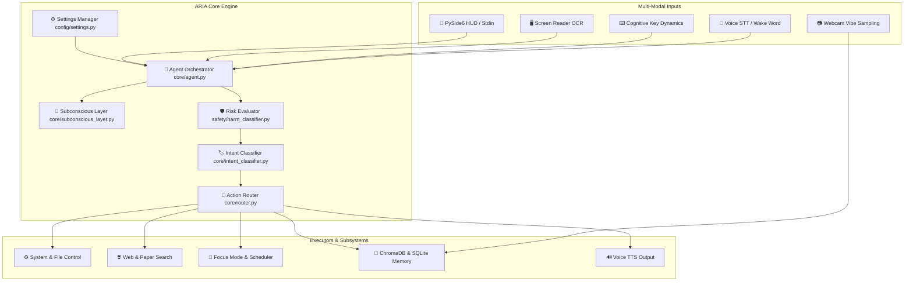

# 🤖 ARIA — Autonomous Reactive & Intelligent Assistant

<p align="center">
  
  
  
  
  
  
</p>

---

## 🌟 Overview

**ARIA** (Autonomous Reactive & Intelligent Assistant) is a next-generation, local-first AI desktop assistant for Windows. Designed for privacy, high efficiency, and multi-modal interaction, ARIA seamlessly integrates **voice controls ("Hey ARIA")**, **webcam emotion & vibe sampling**, **cognitive load analysis**, **screen reading OCR**, **touchless gesture tracking**, and **deep system automation** into a unified glassmorphic interface.

Whether you need to automate multi-step system workflows, enforce deep-work focus sessions, research academic papers, manage daily schedules, or analyze your cognitive dynamics while typing, ARIA handles it all locally without transmitting your personal data to external clouds.

---

## ✨ Key Feature Highlights

### 🎤 1. Multi-Modal Perception Engine
- **Voice Pipeline:** Offline wake-word detection (*"Hey ARIA"*) via `openwakeword`, local Faster-Whisper Speech-To-Text, and natural vocal responses (`pyttsx3`/`Coqui-TTS`).
- **Webcam Vibe & Emotion Sampling:** Background DeepFace camera sampling tracks stress, fatigue, and mood, automatically adjusting daily workload routines.
- **Cognitive Load Monitor:** Evaluates inter-key typing dynamics and backspace frequency via `pynput` to detect mental fatigue.
- **Screen Reader OCR:** Takes periodic screenshots and reads active window context to proactively surface hints when user workflows stall.
- **Kinetic Gesture Controller:** Touchless MediaPipe webcam hand-tracking for controlling volume, tab navigation, and window switching.

### 🛠️ 2. Deep System Automation & Browser Agent
- **60+ Registered Intents:** Control applications, system power (lock, sleep, restart), Wi-Fi, Bluetooth, volume, screenshots, and display brightness.
- **File System Operations:** Create, move, copy, search, open, and safely delete files with Recycle Buffer protection.
- **Web Scraping & Research:** Automated web search, browser navigation, weather reports, stock quotes, and academic paper retrieval (ArXiv, Semantic Scholar, PubMed).
- **Media Control & Messaging:** Play/pause music, skip tracks, adjust Spotify/Chrome volume, and send platform messages.

### 🎯 3. Productivity & Focus Guardian
- **Focus Mode:** Enforces Pomodoro deep-work blocks and automatically blocks distraction domains by updating the Windows hosts file.
- **Productivity Guardian:** Background monitor that alerts you when spending excessive time on distracting applications.
- **Goal Decomposer:** Breaks down high-level projects into actionable sub-tasks using SuperMemo-2 (SM-2) spaced repetition algorithm.
- **Autonomous Planner:** Delivers automated morning briefings and evening accomplishment reviews.

### 🛡️ 4. Safety, Governance & Memory
- **Safety Gate:** Evaluates command risk levels (`SAFE`, `CONFIRMATION_REQUIRED`, `BLOCKED`) before execution.
- **Recycle Buffer:** Soft-deletes files to prevent accidental data loss.
- **Audit Logging:** Logs all executed actions and safety verdicts to JSON-L audit files.
- **Long-Term Memory:** ChromaDB vector store for semantic context, SQLite for full interaction history, habit tracking, and JSON Knowledge Graph.

---

## 🏗️ System Architecture



---

## 🚀 Quick Start Guide

### Prerequisites
- **OS:** Windows 10 or Windows 11 (64-bit)
- **Python:** Python 3.10+
- **Ollama Engine:** Download and install from [ollama.ai](https://ollama.ai)

### 1. Installation
Clone the repository and set up a virtual environment:
```powershell
# Clone workspace
cd d:\canvas\ARIA

# Create and activate Python virtual environment
python -m venv venv
.\venv\Scripts\Activate.ps1

# Install dependencies
pip install -r requirements.txt
```

### 2. Provision Local LLM Models
Pull the required Ollama models:
```powershell
ollama pull llama3
ollama pull mistral
ollama pull llava
```

### 3. Launch ARIA

#### Desktop Mode (Full Glassmorphic GUI & System Tray Icon)
```powershell
python main.py
```

#### Headless Mode (Terminal & Voice Only)
```powershell
python main.py --headless
```

---

## 💬 Voice & Command Cheat Sheet

| Category | Example Command |
|----------|-----------------|
| **System Control** | *"Open Notepad"*, *"Lock screen"*, *"Set volume to 50%"*, *"Take a screenshot"* |
| **File Operations** | *"List files in Desktop"*, *"Create file note.txt"*, *"Safe delete temp.txt"* |
| **Focus & Work** | *"Start focus mode for 45 minutes on coding"*, *"Stop focus mode"* |
| **Web & Research** | *"Search ArXiv for transformer papers"*, *"Check weather in London"*, *"Get AAPL stock price"* |
| **Planning & Goals**| *"Plan my day"*, *"What's next?"*, *"Decompose goal 'Launch Product' with deadline 2026-08-30"* |
| **Habits & Profile**| *"Show my habits"*, *"Mark exercise habit done"*, *"Show my profile"* |
| **Settings** | *"Show settings"*, *"Turn off emotion detector"*, *"Switch model to mistral"* |
| **Kinetic Mode** | *"Activate kinetic mode"* (Opens gesture control window) |

---

## 📁 Repository Directory Structure

```
ARIA/
├── config/              # Centralized configuration & aria_settings.json
├── core/                # Agent orchestrator, router, classifier & subconscious layer
├── modules/             # Automation tools (browser, focus mode, social agent, downloads)
├── vision/              # Emotion detector, cognitive monitor, screen reader & gesture control
├── voice/               # Wake word listener, Whisper STT & TTS engines
├── ui/                  # PySide6 desktop HUD overlay, chat window & tray icon
├── memory/              # ChromaDB vector store, SQLite logs, habits & knowledge graph
├── safety/              # Harm classifier, risk assessment & recycle buffer
├── scheduler/           # Goal decomposer, task tracker, optimizer & autonomous planner
├── tests/               # Phase 1 through Phase 6 test suite
├── doc/                 # Detailed system documentation
│   ├── architecture.md
│   ├── modules_reference.md
│   ├── settings_and_configuration.md
│   ├── api_and_integration_guide.md
│   ├── user_guide.md
│   └── deployment_plan.md
├── planing/             # Development guides, test plans, and deployment plan
│   └── deployment_plan.md
├── main.py              # Main entry point & daemon thread bootstrap
└── requirements.txt     # Complete Python package dependencies
```

---

## 📚 Complete System Documentation

Detailed technical guides are available inside the [`doc/`](doc/) and [`planing/`](planing/) folders:
- 📖 [**System Architecture & Design**](doc/architecture.md)
- 🧩 [**Complete Module Reference Manual**](doc/modules_reference.md)
- ⚙️ [**Settings & Configuration Guide**](doc/settings_and_configuration.md)
- 🔌 [**API & Technical Integration Guide**](doc/api_and_integration_guide.md)
- 👤 [**User Operating & Command Manual**](doc/user_guide.md)
- 🚀 [**Production Deployment Plan**](planing/deployment_plan.md)

---

## 🧪 Testing & Quality Assurance

Run the automated system test suite to verify core agent functionality, safety risk evaluation, router dispatching, and multi-step parsing:
```powershell
python tests/run_all_tests.py
```

---

## 📄 License

This project is licensed under the **MIT License**.
