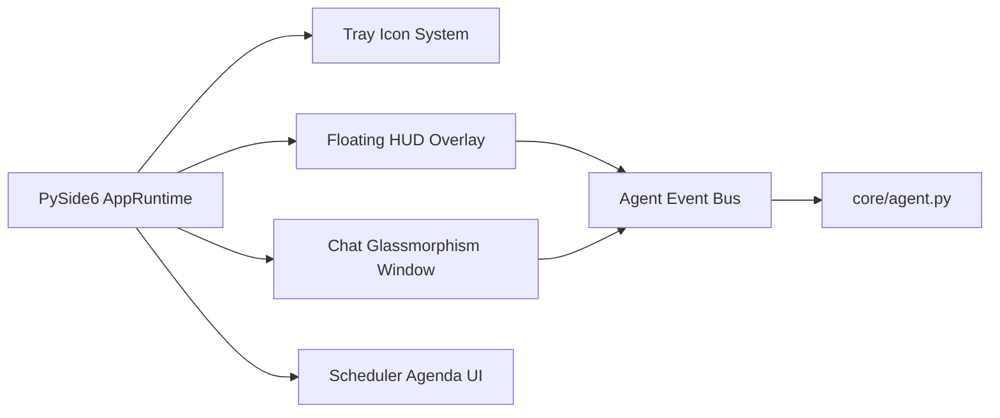

# ARIA API & Technical Integration Guide

This guide describes the core interfaces, LLM integration protocols, system automation hooks, and local database APIs powering ARIA.

---

## 1. LLM & Vision Provider Integration (Ollama REST API)

ARIA connects to local Large Language Models via Ollama's REST endpoints (`http://localhost:11434`).

### 1.1 Text Generation Protocol (`core/intent_classifier.py` & `core/agent.py`)
- **Endpoint:** `POST /api/generate` or `POST /api/chat`
- **Request Format:**
  ```json
  {
    "model": "llama3",
    "prompt": "User instruction...",
    "stream": false,
    "options": {
      "temperature": 0.7
    }
  }
  ```
- **Structured JSON Mode:** The Intent Classifier mandates structured JSON output for tool invocation:
  ```json
  {
    "intent": "open_app",
    "args": {
      "app_name": "notepad"
    }
  }
  ```

### 1.2 Multimodal Vision Protocol (`modules/social_agent.py`)
- **Model:** `llava` (or specified vision model)
- **Base64 Encoding:** Screen clips or captured social post images are encoded as Base64 strings before dispatching to `/api/generate`.

---

## 2. Voice Subsystem Interfaces (`voice/`)

### 2.1 Wake-Word Listener (`voice/wake_word.py`)
- **Engine:** `openwakeword`
- **Audio Stream:** 16kHz mono PCM stream captured via `PyAudio`.
- **Callback Signature:**
  ```python
  def start_wake_word_listener(on_wake_callback: Callable[[int], None]) -> None:
      ...
  ```

### 2.2 Speech-to-Text (`voice/stt.py`)
- **Engine:** Faster-Whisper / OpenAI Whisper
- **Function Signature:**
  ```python
  def listen_and_transcribe(model_name: str = "base", input_device_index: Optional[int] = None) -> str:
      ...
  ```

### 2.3 Text-to-Speech (`voice/tts.py`)
- **Engine:** Offline `pyttsx3` with optional Coqui-TTS fallback.
- **Function Signature:**
  ```python
  def speak(text: str) -> None:
      ...
  ```

---

## 3. Database & Memory Storage APIs (`memory/`)

### 3.1 Vector Database (`memory/vector_store.py`)
- **Engine:** `chromadb`
- **Persistence Path:** `memory/chroma_db`
- **Methods:**
  ```python
  vs = VectorStore()
  vs.add_document(text="User note", metadata={"category": "preference"})
  results = vs.similarity_search(query="favorite code editor", top_k=3)
  ```

### 3.2 Interaction Log DB (`memory/conversation_log.py`)
- **Engine:** SQLite (`memory/conversation.db`)
- **Table Schema:**
  ```sql
  CREATE TABLE IF NOT EXISTS interactions (
      id INTEGER PRIMARY KEY AUTOINCREMENT,
      timestamp TEXT,
      user_input TEXT,
      response TEXT,
      source TEXT,
      metadata TEXT
  );
  ```

### 3.3 Knowledge Graph API (`memory/knowledge_graph.py`)
- **Engine:** Local JSON Entity Graph (`memory/knowledge_graph.json`)
- **Functions:**
  ```python
  from memory.knowledge_graph import add_relation, query_formatted
  add_relation(subject="VSCode", predicate="used_for", object_entity="Python Coding")
  summary = query_formatted("Python")
  ```

---

## 4. Windows System Automation Hooks (`modules/system_control.py`)

ARIA leverages direct Windows native APIs and Python automation libraries:

| Capability | Underlying System Hook / Module |
|------------|----------------------------------|
| **Window Management** | `pywinauto.Desktop(backend="uia")` |
| **Process Control** | `psutil.process_iter()`, `process.kill()` |
| **Global Mouse & Key Events** | `pyautogui`, `ctypes.windll.user32` |
| **System Power Controls** | `subprocess.run(["shutdown", "/s", "/t", "5"])` |
| **Screen Locking** | `ctypes.windll.user32.LockWorkStation()` |
| **Network Interfaces** | `netsh interface set interface Wi-Fi ...` |
| **Host Blocking (Focus Mode)** | Direct edits to `C:\Windows\System32\drivers\etc\hosts` |

---

## 5. UI Integration Architecture (`ui/`)

ARIA UI is built with **PySide6 (Qt for Python)**.



- **Thread Safety:** All background thread alerts (emotion updates, productivity warnings, autonomous briefings) communicate with the UI via PySide `QThread` signals to avoid cross-thread GUI crashes.
