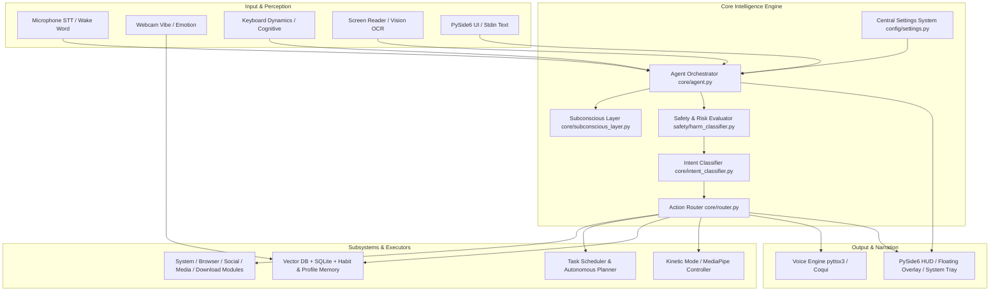

# ARIA System Architecture & Design Specification

> **Project Name:** ARIA (Autonomous Reactive & Intelligent Assistant)  
> **Target OS:** Windows 10/11  
> **Core Stack:** Python 3.10+, PySide6, Local LLM (Ollama/LLaVA), Whisper, openwakeword, ChromaDB, OpenCV, MediaPipe, DeepFace  

---

## 1. Architectural Overview

ARIA is an autonomous, privacy-focused, multi-modal AI assistant designed for desktop automation, proactive context monitoring, and intelligent task execution on Windows environments. The system operates locally to ensure user privacy while providing continuous voice, vision, and cognitive monitoring.



---

## 2. Core Subsystems & Pipeline Mechanics

### 2.1 Settings Bootstrap System (`config/settings.py`)
- **Initialization:** Loads settings first before any module reads environment variables (`_apply_settings_to_env()`).
- **Storage:** Persisted in `config/aria_settings.json` with dot-notation lookup (`get_setting("section.key")`).
- **Dynamic Updates:** Supports natural language runtime updates (e.g., *"switch model to mistral"*, *"enable focus mode"*).

### 2.2 Input & Multi-Modal Perception Layer
1. **Voice STT & Wake Word (`voice/`):**
   - Uses `openwakeword` for low-latency offline wake word detection ("Hey ARIA").
   - Transcribes audio using Faster-Whisper / OpenAI Whisper with customizable models (`base`, `small`, `medium`).
   - Supports continuous listening sessions (`VOICE_SESSION_SECONDS`).
2. **Webcam Emotion & Vibe Sampling (`vision/emotion_detector.py`):**
   - Background sampling using DeepFace/OpenCV to track user stress, fatigue, and frustration.
   - Triggers automated workload rescheduling when high fatigue is detected.
3. **Cognitive Load Monitor (`vision/cognitive_monitor.py`):**
   - Evaluates inter-key latency and backspace frequency via `pynput`.
   - Injects cognitive stress markers into the assistant prompt to adjust response brevity and tone.
4. **Screen Reader (`vision/screen_reader.py`):**
   - Periodic screen capture & OCR context aggregation.
   - Detects stuck workflows or user confusion, feeding proactive hints into the agent loop.
5. **Kinetic & Gesture Controller (`vision/gesture_contoll/`):**
   - MediaPipe hand-tracking pipeline for touchless gesture controls (volume adjustment, tab navigation, window switching).

### 2.3 Agent Orchestrator & Context Assembly (`core/agent.py`)
When a prompt or voice command arrives, the `Agent` orchestrates context enrichment:
- **Context Stack:** Active UI context + Screen summary + Vibe state + Cognitive load level + Subconscious topic markers + User profile memory + Vector DB semantic retrieval.
- **System Prompt Formatting:** Generates dynamic prompts maintaining the ARIA persona ("Sir"-addressing, highly respectful, efficient).

### 2.4 Safety Gate & Confirmation Engine (`safety/`)
Before execution, every command is evaluated by `assess_risk()`:
- **Risk Tiers:**
  - `SAFE`: Executed automatically without delay.
  - `CONFIRMATION_REQUIRED`: Requires explicit user prompt approval (e.g., file deletion, system reboot, bulk download).
  - `BLOCKED`: Dangerous or destructive actions rejected immediately.
- **Recycle Buffer (`safety/recycle_buffer.py`):** Replaces permanent file deletions with soft-delete recycling.
- **Audit Logging (`safety/audit_log.py`):** Appends timestamped intent executions and safety verdicts to JSON-L logs.

### 2.5 Intent Classification & Action Router (`core/router.py`)
- **Hybrid Intent Resolver:** Uses direct keyword aliasing for instant dispatch, falling back to LLM structured intent extraction for complex natural language queries.
- **Supported Capabilities (60+ Intents):**
  - **System:** Power actions, brightness, Wi-Fi, Bluetooth, volume, screenshots, window control.
  - **File System:** Open, create, move, copy, safe delete, directory listing, alias resolution.
  - **Browser & Web:** Web search, URL navigation, DOM interactions, paper search (ArXiv/Semantic Scholar/PubMed), stock quotes, weather reports.
  - **Focus & Productivity:** Pomodoro timer, host file website blocker, distraction guardian.
  - **Memory & Habits:** Profile querying, habit tracking, SM-2 spaced-repetition goal decomposition, JSON Knowledge Graph queries.

---

## 3. Data Flow Diagram

```
User Command (Voice/Text)
       │
       ▼
Settings Verification ──► Safety Gate (assess_risk)
                               │
                ┌──────────────┴──────────────┐
                ▼                             ▼
        [SAFE / CONFIRMED]              [BLOCKED / CANCELLED]
                │                             │
                ▼                             ▼
       Intent Classification            Abort Execution & Log Warning
                │
                ▼
       Router Dispatch Handler
                │
    ┌───────────┼───────────┬───────────┐
    ▼           ▼           ▼           ▼
 Exec Subsys  Memory DB  Scheduler   UI/Voice TTS Output
```

---

## 4. Concurrency & Daemon Thread Management

ARIA uses thread-safe daemon processes initialized at boot time (`main.py`):
1. **Main Thread:** PySide6 Event Loop (GUI & System Tray Icon).
2. **Voice Daemon:** Background wake word listener & audio streaming queue.
3. **Emotion Sampling Daemon:** Periodic webcam grabber (default: 60s interval).
4. **Cognitive Dynamics Daemon:** Non-blocking keypress event listener.
5. **Productivity Guardian Daemon:** Periodic window title & process monitor.
6. **Autonomous Planner Daemon:** Scheduled morning briefing & evening review trigger.

---

## 5. Security & Isolation Considerations

- **Local Execution First:** Core LLMs and Whisper models run strictly locally via Ollama and PyTorch.
- **Privilege Separation:** Host file manipulation for website blocking requires elevated Administrator privileges; other features run as standard user process.
- **Data Protection:** Conversation logs and vector stores are stored in local SQLite (`memory/conversation.db`) and ChromaDB directories.
