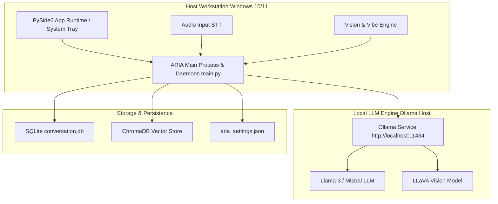
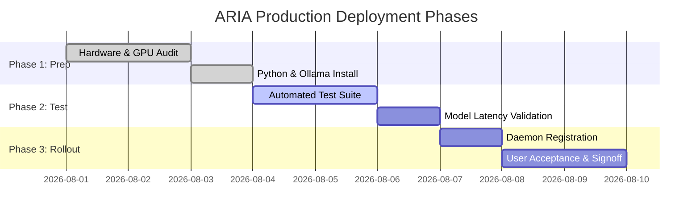

# ARIA Production Deployment Plan

> **Document Version:** 1.0.0  
> **Target Platform:** Windows 10 / Windows 11 / Windows Server 2022  
> **Location:** `planing/deployment_plan.md`  

---

## 1. Executive Summary & Objectives

This Deployment Plan outlines the complete end-to-end strategy for provisioning, configuring, hardening, and deploying **ARIA (Autonomous Reactive & Intelligent Assistant)** into production workstation and desktop environments.

The primary objective is to deliver a zero-downtime, fully autonomous local assistant with reliable background thread daemons, local LLM orchestration via Ollama, secure file operation gates, and automatic system startup.

---

## 2. Target Deployment Architectures



### Deployment Modes:
1. **Single-Host Workstation (Standard):** ARIA, Ollama, Whisper, and ChromaDB all run locally on the primary user workstation.
2. **Hybrid Client-Server:** ARIA UI & perception daemons run on user workstation; heavy Ollama LLM inferences are routed over local LAN to a dedicated GPU server (`http://192.168.x.x:11434`).

---

## 3. Hardware & Infrastructure Prerequisites

### Minimum Hardware Specs:
- **CPU:** Quad-Core Intel i5 / AMD Ryzen 5 (3.0 GHz+)
- **RAM:** 16 GB DDR4/DDR5
- **GPU:** NVIDIA RTX 3060 (8GB VRAM) or better for fast local LLM / Whisper execution (CPU fallback supported, but higher latency).
- **Storage:** 50 GB NVMe SSD free space (for Ollama models, PyTorch cache, ChromaDB).
- **Peripherals:** Windows-compatible Microphone & Webcam (720p+).

### Operating System & Dependencies:
- **OS:** Windows 10 (21H2+) or Windows 11 (64-bit)
- **Python:** Python 3.10.x or 3.11.x
- **Build Tools:** Visual Studio C++ Build Tools (required for `PyAudio` compilation)
- **Ollama Engine:** v0.1.30 or higher

---

## 4. Step-by-Step Installation & Provisioning

### Step 1: Environment Setup
Clone the repository and initialize a clean Python virtual environment:
```powershell
# Navigate to deployment target directory
cd d:\canvas\ARIA

# Create virtual environment
python -m venv venv

# Activate virtual environment
.\venv\Scripts\Activate.ps1
```

### Step 2: Install Dependencies
Upgrade core packaging tools and install requirements:
```powershell
python -m pip install --upgrade pip setuptools wheel
pip install -r requirements.txt
```

### Step 3: Install & Provision Ollama Models
Install Ollama for Windows from [ollama.ai](https://ollama.ai), then pull the required models:
```powershell
# Pull primary language model
ollama pull llama3

# Pull fallback language model
ollama pull mistral

# Pull vision model for social post analysis
ollama pull llava
```

### Step 4: Environment & Settings Initialization
Create `config/.env` file from configuration settings:
```ini
LLM_MODEL=llama3
VISION_MODEL=llava
OLLAMA_URL=http://localhost:11434
VOICE_MODE=wakeword
VOICE_MODEL=base
EMOTION_DETECTOR=1
COGNITIVE_MONITOR=1
PRODUCTIVITY_GUARDIAN=1
AUTONOMOUS_PLANNER=1
```

---

## 5. Production Service & Auto-Start Configuration

To ensure ARIA automatically starts upon user login and runs uninterrupted in the background:

### Option A: Windows Startup Folder (Recommended for Desktop UI)
1. Create a batch launcher script `launch_aria.bat` in project root:
```bat
@echo off
cd /d "d:\canvas\ARIA"
call .\venv\Scripts\activate.bat
start "" pythonw.exe main.py
```
2. Press `Win + R`, type `shell:startup`, and place a shortcut to `launch_aria.bat` in the Startup folder.

### Option B: Windows Task Scheduler (Recommended for Headless Server Mode)
Run PowerShell command as Administrator to register a boot task:
```powershell
$action = New-ScheduledTaskAction -Execute "d:\canvas\ARIA\venv\Scripts\pythonw.exe" -Argument "d:\canvas\ARIA\main.py --headless" -WorkingDirectory "d:\canvas\ARIA"
$trigger = New-ScheduledTaskTrigger -AtLogOn
Register-ScheduledTask -TaskName "ARIA_Assistant_Daemon" -Action $action -Trigger $trigger -RunLevel Highest
```

---

## 6. Security, Risk & Privilege Hardening

1. **Administrator Privileges:**
   - Website domain blocking in Focus Mode (`modules/focus_mode.py`) requires Administrator access to edit `C:\Windows\System32\drivers\etc\hosts`. Run the launcher script elevated if Focus Mode blocking is required.
2. **Safety Risk Evaluation Gate:**
   - Ensure `security.confirmation_for_dangerous` remains set to `true` in `config/aria_settings.json`.
3. **Audit Logging Policy:**
   - All executed intents and risk verdicts are written to `data/audit_log.jsonl`. Verify log file permissions to restrict unauthorized modification.
4. **Data Isolation:**
   - Ensure `memory/conversation.db` and `memory/chroma_db` permissions are restricted to the local user account.

---

## 7. Operations, Maintenance & Backup Strategy

### 7.1 Database Maintenance & Compaction
- **SQLite Vacuuming:** Run monthly compaction on `memory/conversation.db` to optimize query performance:
  ```sql
  VACUUM;
  ```
- **ChromaDB Maintenance:** Periodically prune unused embeddings from `memory/chroma_db`.

### 7.2 Log Rotation Policy
Configure automatic truncation or archiving for `data/audit_log.jsonl` when file size exceeds 50 MB.

### 7.3 State Backup Script (`backup_aria_state.ps1`)
```powershell
$backupDir = "d:\canvas\ARIA_backups\" + (Get-Date -Format "yyyyMMdd_HHmmss")
New-Item -ItemType Directory -Path $backupDir
Copy-Item "d:\canvas\ARIA\config\aria_settings.json" -Destination $backupDir
Copy-Item "d:\canvas\ARIA\memory\conversation.db" -Destination $backupDir
Copy-Item "d:\canvas\ARIA\data\task_tracker.json" -Destination $backupDir
Write-Host "ARIA State successfully backed up to $backupDir"
```

---

## 8. Multi-Phase Deployment Rollout Strategy



### Verification Checklist:
- [ ] PySide6 UI launches with system tray icon.
- [ ] Wake-word ("Hey ARIA") activates listening state.
- [ ] Ollama service responds to text and vision prompts.
- [ ] Webcam emotion sampling records vibe states without dropping frames.
- [ ] Focus mode successfully updates hosts file and blocks distraction domains.
- [ ] Automated tests pass via `python tests/run_all_tests.py`.
