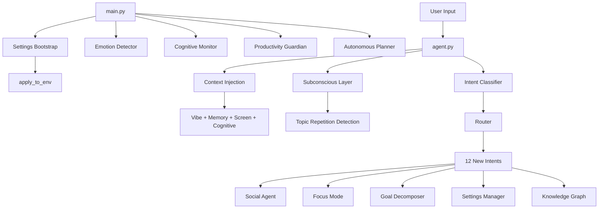

# ARIA Upgrade — Implementation Summary

## ✅ All Changes Pushed to `dev_upgrade_workspace`

---

## New Modules Created

| Module | Purpose |
|--------|---------|
| `config/settings.py` | **Centralized settings system** — JSON-backed, dot-notation access, NL command parsing, env-var bridging |
| `modules/social_agent.py` | Social media comment generation + selected text explanation via LLaVA |
| `modules/focus_mode.py` | Deep work mode with Pomodoro timer, website blocking, flow scoring, session analytics |
| `modules/productivity_guardian.py` | Background distraction detection with schedule-aware alerting |
| `vision/cognitive_monitor.py` | Keyboard timing analysis (inter-key intervals, backspace rate) for cognitive load detection |
| `core/subconscious_layer.py` | Detects repeated unresolved topics across conversations to surface proactive suggestions |
| `scheduler/goal_decomposer.py` | Goal → subtask breakdown with SM-2 spaced repetition scheduling |
| `scheduler/autonomous_planner.py` | Automated morning briefing + evening review at configurable times |
| `memory/knowledge_graph.py` | JSON-based entity graph linking actions, apps, files, and searches |

## Modified Files

| File | Changes |
|------|---------|
| `main.py` | Settings bootstrap at startup + daemon thread management for all new services |
| `core/router.py` | 12 new intents registered (comment, explain, focus, goals, settings, knowledge, habits, profile) |
| `core/intent_classifier.py` | LLM prompt updated with all new intent definitions + examples |
| `core/agent.py` | Cognitive state injection into context prompt + subconscious nudge on conversational replies |
| `modules/content_generator.py` | Now reads model + temperature from settings system |
| `modules/system_control.py` | Added `get_selected_text()` for clipboard-based text selection |
| `scheduler/tracker.py` | Added `get_current_scheduled_task()` for productivity guardian |
| `memory/habit_tracker.py` | Added `get_all_habits_summary()` for "show habits" command |
| `memory/user_profile.py` | Added `get_profile_summary()` for "show profile" command |
| `requirements.txt` | Added `pynput>=1.7.0` |

## Settings System — What You Can Control

> [!TIP]
> Say "show settings" to see all settings, or "show settings emotion" for a specific section.

**Voice/text commands work naturally:**
- *"turn off emotion detector"*
- *"set screen reader interval to 120 seconds"*
- *"switch model to mistral"*
- *"enable productivity guardian"*
- *"change morning briefing time to 07:00"*

### Configurable Sections

| Section | Key Settings |
|---------|-------------|
| **🤖 LLM** | model, vision_model, temperature, ollama_url |
| **😊 Emotion** | enabled, interval (default 60s), camera_index, vibe rules |
| **🖥️ Screen Reader** | enabled, interval (default 60s), stuck_minutes |
| **🧠 Cognitive Monitor** | enabled, update_interval, alert_threshold |
| **🛡️ Productivity Guardian** | enabled, distraction_threshold, distraction_apps list |
| **🎯 Focus Mode** | work/break durations, blocked domains |
| **📅 Autonomous Planner** | enabled, morning_briefing_time, evening_review_time |
| **🎤 Voice** | mode (wakeword/always/off), stt_model, session_seconds |
| **🔒 Security** | confirmation for dangerous, audit log, data masking |
| **🎨 UI** | theme (dark/light), overlay, narration |

## Architecture

## Safety Notes

> [!IMPORTANT]
> - All new intents go through the existing `assess_risk()` safety gate in the router
> - Focus mode website blocking requires Administrator privileges
> - Settings changes are logged with timestamps in `aria_settings.json`
> - The productivity guardian only alerts — it never closes apps without explicit user confirmation
